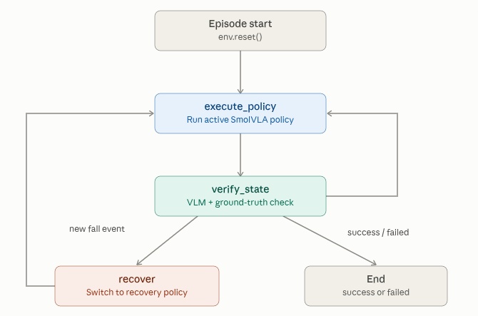

# SO-101 Agentic VLA: Hierarchical VLM-Guided Failure Detection and Policy Recovery

This project builds an agentic supervised framework for a pick-place task driven by a LangGraph supervisor that detects, via a VLM, when the arm accidentally knocks the can over mid-grasp (an out-of-distribution state the base policy was never trained to recover from) and routes to a dedicated recovery policy fine-tuned specifically for picking up a fallen can. See [`PLAN.md`](PLAN.md) for the full design. 
The simulation is developed with MuJuCo for the SO-101 arm, gamepad teleop, and a LeRobot `Robot`/`Teleoperator` bridge for recording pick-and-place datasets and fine-tuning SmolVLA



## Recorded dataset


*Episode 49 of [`hungdo2401/so101_baseline`](https://huggingface.co/datasets/hungdo2401/so101_baseline)
-- front camera (left) and wrist camera (right).*


*-- `action`/`observation.state`, per joint, over time.*

A pick-and-place dataset (can into bin, gamepad-teleoperated, per-episode-pose-randomized) is already recorded and pushed to the Hub, along with a MimicGen-augmented dataset built on top of it (segment-and-retarget MimicGen from human reference demos):

- **Baseline dataset** (50 episodes): https://huggingface.co/datasets/hungdo2401/so101_baseline
- **MimicGen-augmented dataset** (100 episodes, denser can-position coverage): https://huggingface.co/datasets/hungdo2401/so101_mimicgen_aug
- **Combined dataset** (baseline + augmentation = 150 episodes): https://huggingface.co/datasets/hungdo2401/so101_baseline_plus_mimicgen
- **Fallen-can recovery dataset** (30 fallen baseline + 120 augmentation = 150 episodes): https://huggingface.co/datasets/hungdo2401/so101_fallen_plus_mimicgen

If you want to record your *own* dataset instead of reusing the one above for fine-tuning, follow [Record](#usage)

## Evaluation Results


**Fine-tuning**: all [`baseline`](https://huggingface.co/hungdo2401/smolvla_so101_baseline), [`baseline_plus_mimicgen`](https://huggingface.co/hungdo2401/smolvla_so101_baseline_plus_mimicgen), and [`fallen_plus_mimicgen`](https://huggingface.co/hungdo2401/smolvla_so101_fallen_plus_mimicgen) policies
are `lerobot/smolvla_base` fine-tuned with identical hyperparameters (20k steps,
`batch_size=64`):


| Policy | Success rate | 95% CI (Wilson) |
|---|---|---|
| Unaugmented Baseline (`baseline`) | 60/100 = 60.0% | [50.2%, 69.1%] |
| Augmented Baseline Without Recovery (`baseline_plus_mimicgen`) | 73/100 = 73.0% | [63.6%, 80.7%] |
| Agentic Supervisor (`baseline_plus_mimicgen` + `fallen_plus_mimicgen`) | 81/100 = 81.0% | [72.2%, 87.5%] |


**Failure Types:**

| Policy | Timeout fails | Early/catastrophic fails |
|---|---|---|
| Unaugmented Baseline (`baseline`) | 40/100 | 0/100 |
| Augmented Baseline Without Recovery (`baseline_plus_mimicgen`) | 25/100 | 2/100 |

**Agentic supervisor's failure recovery:**

| Fail Event | Episodes | Success | Fail |
|---|---|---|---|
| Can never fell (base policy only, no recovery triggered) | 88 | 74 | 14 |
| Can fell at least once (recovery triggered) | 12 | 7 | 5 |


**Reproduce:**
Evaluate the baseline and mimic policy without supervisor (swap `--policy-path` for the baseline)
```bash
python scripts/eval_policy.py \
  --policy-path=hungdo2401/smolvla_so101_baseline_plus_mimicgen \
  --single-task="pick up the can and place it in the bin" \
  --num-episodes=100 \
  --seed=0
```
Evaluate the agentic supervisor framework
```bash
python scripts/supervisor.py  \
  --base-policy-path=hungdo2401/smolvla_so101_baseline_plus_mimicgen  \
  --recovery-policy-path=hungdo2401/smolvla_so101_fallen_plus_mimicgen  \
  --single-task="pick up the can and place it in the bin"  \
  --recovery-single-task="pick up the fallen can and place it in the bin"  \
  --num-episodes=100  \
  --seed=0  \
  --display-data  \
```

## Repo layout

```
assets/            MJCF scene, SO-101 meshes, can mesh/texture
so101_mujoco_env/  gym.Env + gamepad teleop
lerobot_bridge/    LeRobot Robot/Teleoperator bridge (pip-installable)
scripts/           asset generation, grasp-trigger test, dataset recording, MimicGen augmentation
notebooks/         Colab fine-tuning notebook
```

## Prerequisites

- Ubuntu (or other Linux)
- [Miniconda](https://docs.conda.io/en/latest/miniconda.html)
- A gamepad (for teleop/recording)
- No GPU needed -- training runs on Colab

Details/rationale: see [`PLAN.md`](PLAN.md#setup--environment-notes).

## Setup

### 1. Clone this repo
```bash
git clone https://github.com/<your-username>/so101_mujoco_sim2real.git
cd so101_mujoco_sim2real
```

### 2. Create a conda environment
```bash
conda create -n lerobot python=3.12 -y
conda activate lerobot
```

### 3. Install LeRobot from source, at the pinned commit
```bash
git clone https://github.com/huggingface/lerobot.git ~/robotics_ws/lerobot
cd ~/robotics_ws/lerobot
git checkout e6f956746ef0c8f05786f64deb4f98dddbe8de8c
pip install -e ".[core_scripts,smolvla]"
```
(why this commit, what `core_scripts`/`smolvla` pull in: see [`PLAN.md`](PLAN.md#setup--environment-notes))

### 4. Install this project's LeRobot bridge
```bash
pip install -e lerobot_bridge
```

### 5. (Optional) asset-regeneration dependencies
Only needed to re-run `scripts/fetch_so101_urdf.py`; not needed for normal use.
```bash
pip install coacd trimesh pycollada rtree
```

### 6. Verify the install
```bash
python -m so101_mujoco_env.joint_teleop --print-only   # Ctrl+C to stop

python3 -c "
from lerobot.utils.import_utils import register_third_party_plugins
register_third_party_plugins()
from lerobot.robots.config import RobotConfig
from lerobot.teleoperators.config import TeleoperatorConfig
RobotConfig.get_choice_class('so101_mujoco')
TeleoperatorConfig.get_choice_class('so101_mujoco_teleop')
print('OK: both registered')
"
```

## Environment quirks

- `PYGLFW_LIBRARY_VARIANT=x11` -- needed on native Wayland when using MuJoCo's passive 3D viewer.
- `MUJOCO_GL=osmesa` or `egl` -- if offscreen camera rendering fails (e.g. headless server).
- Gamepad mapping: `so101_mujoco_env/config/gamepad.config.yaml` (PS4/PS5 profile verified;   adjust for other pads).

Full explanations: see [`PLAN.md`](PLAN.md#setup--environment-notes).

## Usage

**Live teleop**:
```bash
python -m so101_mujoco_env.joint_teleop --cameras
```

**Record a dataset**:
```bash
python scripts/record_dataset.py \
  --repo-id=<your_hf_username>/so101_baseline \
  --num-episodes=100 \
  --single-task="pick up the can and place it in the bin" \
  --no-viewer
```

**Fine-tune SmolVLA**: open
[`notebooks/train_smolvla_colab.ipynb`](notebooks/train_smolvla_colab.ipynb) in Colab.

