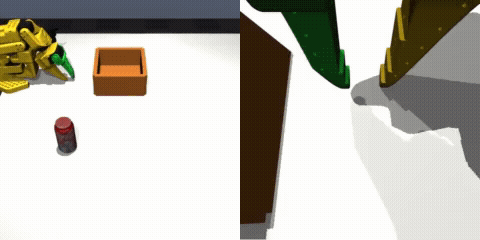
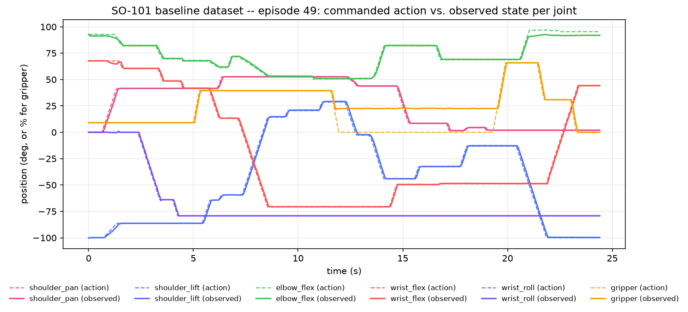

# SO-101 Agentic VLA: Hierarchical VLM-Guided Failure Detection and Policy Recovery

Builds on the MuJoCo SO-101 pick-and-place stack from `so101_mujoco_sim2real` (same simulation,
environment, LeRobot `Robot`/`Teleoperator` bridge, and SmolVLA fine-tuning pipeline — copied
over as-is) with a new, separate objective: a LangGraph supervisor that detects, via a VLM, when
the arm accidentally knocks the can over mid-grasp (an out-of-distribution state the base policy
was never trained to recover from) and routes to a dedicated recovery policy fine-tuned
specifically for picking up a fallen can. See [`PLAN.md`](PLAN.md) for the full design.

**Note**: most of the content below (recorded datasets, MimicGen eval results, setup steps) was
inherited along with the reused simulation/environment/bridge code from `so101_mujoco_sim2real`
-- it documents *that* project's prior results, not this one's yet. Revisit once the agentic
supervisor work below has real results of its own to report.

## Recorded dataset -- use it instead of recording your own



*Episode 49 of [`hungdo2401/so101_baseline`](https://huggingface.co/datasets/hungdo2401/so101_baseline)
-- front camera (left) and wrist camera (right).*



*Same episode's recorded `action`/`observation.state`, per joint, over time -- regenerated
directly from the dataset's parquet data.*

A 50-episode pick-and-place dataset (can into bin, gamepad-teleoperated, per-episode
pose-randomized) is already recorded and pushed to the Hub, along with a MimicGen-augmented
dataset built on top of it (see [Result](#result-mimicgen-augmentation-vs-the-50-episode-baseline)
below for why):

- **Baseline dataset** (50 episodes): https://huggingface.co/datasets/hungdo2401/so101_baseline
- **Interactive viewer**: https://huggingface.co/spaces/lerobot/visualize_dataset?path=%2Fhungdo2401%2Fso101_baseline%2Fepisode_49
- **MimicGen-augmented dataset** (100 episodes, denser can-position coverage): https://huggingface.co/datasets/hungdo2401/so101_mimicgen_aug
- **Combined dataset** (baseline + augmented, 150 episodes): https://huggingface.co/datasets/hungdo2401/so101_baseline_plus_mimicgen

If you just want to **fine-tune SmolVLA or test the training pipeline**, you don't need the
MuJoCo simulation, the gamepad, or any of the setup below -- point
[`notebooks/train_smolvla_colab.ipynb`](notebooks/train_smolvla_colab.ipynb) (or your own
`lerobot-train` command) at `--dataset.repo_id=hungdo2401/so101_baseline` and go.

The rest of this README covers reproducing the **simulation + recording pipeline itself** --
follow it if you want to record your *own* dataset instead of reusing the one above.

## Result: MimicGen augmentation vs. the 50-episode baseline

<details>
<summary><b>Why this experiment: does denser position coverage help?</b></summary>

The baseline dataset spreads the can's spawn position uniformly over a continuous 2D box, so
with only 50 episodes each position is essentially seen once at training time -- a likely
ceiling on generalization independent of any sim/real domain gap. The MimicGen-augmented dataset
above tests that directly: 100 additional verified-successful episodes at a much denser sampling
of positions.

</details>

**Fine-tuning**: both [`hungdo2401/smolvla_so101_baseline`](https://huggingface.co/hungdo2401/smolvla_so101_baseline)
and [`hungdo2401/smolvla_so101_baseline_plus_mimicgen`](https://huggingface.co/hungdo2401/smolvla_so101_baseline_plus_mimicgen)
are `lerobot/smolvla_base` fine-tuned with identical hyperparameters (20k steps,
`batch_size=64`) -- the dataset is the only variable between them, by design.

**Sim-eval** (`scripts/eval_policy.py`, 100 episodes each, identical `--seed=0` so episode *i*
starts from the same can position in both runs -- a paired comparison, not two independent
samples):

| Checkpoint | Success rate | 95% CI (Wilson) |
|---|---|---|
| `smolvla_so101_baseline` | 39/100 = 39.0% | [30.0%, 48.8%] |
| `smolvla_so101_baseline_plus_mimicgen` | 61/100 = 61.0% | [51.2%, 70.0%] |

<details>
<summary><b>Is this a real effect, or noise? (paired McNemar test)</b></summary>

The CIs don't overlap. Because the runs are paired, a McNemar test on the discordant pairs is
more informative: 37 episodes flipped fail→success (baseline failed, augmented succeeded)
against only 15 that flipped the other way (χ²≈8.48, p≈0.004) -- a real effect, not sampling
noise.

</details>

Splitting failures by *how* they failed (`step=600` = timed out without succeeding or the can
falling off; anything else = ended early, almost always the can knocked off the table) shows
*where* the improvement comes from:

| Checkpoint | Timeout fails | Early/catastrophic fails |
|---|---|---|
| `smolvla_so101_baseline` | 40/100 | 21/100 |
| `smolvla_so101_baseline_plus_mimicgen` | 21/100 | 18/100 |

<details>
<summary><b>Where does the improvement actually come from?</b></summary>

Almost the entire improvement is the policy finishing tasks it used to run out of time on
(40%→21%); the catastrophic-failure rate barely moved (21%→18%). Consistent with what the
augmentation actually targets (denser position coverage) rather than any new ability to notice
and recover from a bad grasp -- SmolVLA's `n_obs_steps=1` means it has no temporal memory to do
that regardless of training data.

</details>

<details>
<summary><b>Caveats</b></summary>

Sim-only, says nothing about sim-to-real transfer (see [`PLAN.md`](PLAN.md), Part C/D). Doesn't
move the ~18-21% catastrophic-failure floor, which looks like a different problem than thin
position coverage and likely needs a different fix (more real teleop diversity, domain
randomization, or an architecture with temporal context) rather than more MimicGen data.

</details>

Reproduce:
```bash
python scripts/eval_policy.py \
  --policy-path=hungdo2401/smolvla_so101_baseline_plus_mimicgen \
  --single-task="pick up the can and place it in the bin" \
  --num-episodes=100 \
  --seed=0
```
(swap `--policy-path` for the baseline row)

How this dataset was built (segment-and-retarget MimicGen from 9 human reference demos, and the
three IK bugs that took the accept rate from 0% to 80%): see
[`PLAN.md`](PLAN.md#results-mimicgen-augmentation).

## Repo layout

```
assets/            MJCF scene, SO-101 meshes, can mesh/texture
so101_mujoco_env/  gym.Env + gamepad teleop
lerobot_bridge/    LeRobot Robot/Teleoperator bridge (pip-installable)
scripts/           asset generation, grasp-trigger test, dataset recording, MimicGen augmentation
notebooks/         Colab fine-tuning notebook
```

## Prerequisites

- Ubuntu (or other Linux)
- [Miniconda](https://docs.conda.io/en/latest/miniconda.html)/mamba
- A gamepad (for teleop/recording)
- No GPU needed -- training runs on Colab

Details/rationale: see [`PLAN.md`](PLAN.md#setup--environment-notes).

## Setup

### 1. Clone this repo
```bash
git clone https://github.com/<your-username>/so101_mujoco_sim2real.git
cd so101_mujoco_sim2real
```

### 2. Create a conda environment
```bash
conda create -n lerobot python=3.12 -y
conda activate lerobot
```

### 3. Install LeRobot from source, at the pinned commit
```bash
git clone https://github.com/huggingface/lerobot.git ~/robotics_ws/lerobot
cd ~/robotics_ws/lerobot
git checkout e6f956746ef0c8f05786f64deb4f98dddbe8de8c
pip install -e ".[core_scripts,smolvla]"
```
(why this commit, what `core_scripts`/`smolvla` pull in: see [`PLAN.md`](PLAN.md#setup--environment-notes))

### 4. Install this project's LeRobot bridge
```bash
pip install -e lerobot_bridge
```

### 5. (Optional) asset-regeneration dependencies
Only needed to re-run `scripts/fetch_so101_urdf.py`; not needed for normal use.
```bash
pip install coacd trimesh pycollada rtree
```

### 6. Verify the install
```bash
python -m so101_mujoco_env.joint_teleop --print-only   # Ctrl+C to stop

python3 -c "
from lerobot.utils.import_utils import register_third_party_plugins
register_third_party_plugins()
from lerobot.robots.config import RobotConfig
from lerobot.teleoperators.config import TeleoperatorConfig
RobotConfig.get_choice_class('so101_mujoco')
TeleoperatorConfig.get_choice_class('so101_mujoco_teleop')
print('OK: both registered')
"
```

## Environment quirks

- `PYGLFW_LIBRARY_VARIANT=x11` -- needed on native Wayland when using MuJoCo's passive 3D viewer.
- `MUJOCO_GL=osmesa` or `egl` -- if offscreen camera rendering fails (e.g. headless server).
- Gamepad mapping: `so101_mujoco_env/config/gamepad.config.yaml` (PS4/PS5 profile verified;
  adjust for other pads).

Full explanations: see [`PLAN.md`](PLAN.md#setup--environment-notes).

## Usage

**Live teleop**:
```bash
python -m so101_mujoco_env.joint_teleop --cameras
```

**Record a dataset**:
```bash
python scripts/record_dataset.py \
  --repo-id=<your_hf_username>/so101_baseline \
  --num-episodes=100 \
  --single-task="pick up the can and place it in the bin" \
  --no-viewer
```

**Fine-tune SmolVLA**: open
[`notebooks/train_smolvla_colab.ipynb`](notebooks/train_smolvla_colab.ipynb) in Colab.

## What this repo does *not* include

- **The recorded dataset itself** (video + parquet data) -- lives on the Hugging Face Hub, not
  in this git repo.
- **Trained model checkpoints** -- likewise pushed to the Hub, not committed here.
- A **Hugging Face login** is required to push/pull datasets and checkpoints (`hf auth login`).
